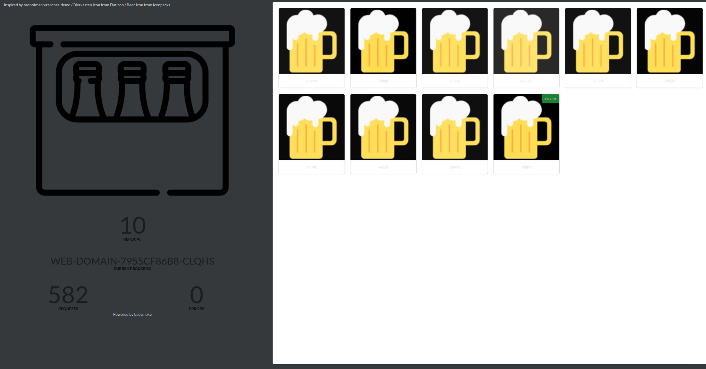

# Rancher/Kubernetes Demo Application

This is a Go demo application used for demonstrating Kubernetes and load balancing.

It will create a colored icon for each replica within a ReplicaSet and indicate which one
most recently served a response. Replicas which haven't been heard from will begin to fade
out, until after a configurable number of seconds they will disappear. This is useful for
demonstrating scaling up/down or in the case of an application like [Rio](https://rio.io),
for showing scale-in of an upgraded application.

## Environment Variables

- `TITLE`: sets title in demo app
- `SHOW_VERSION`: show version of app in ui (`VERSION` env var)
- `REFRESH_INTERVAL`: interval in milliseconds for page to refresh (default: 1000)
- `EXPIRE_INTERVAL`: how long a replica can go without being seen before we remove it from the display (default: 10s)
- `REMOVE_INTERVAL`: how long after `EXPIRE_INTERVAL` until we remove the icon (default: 20s)
- `SKIP_ERRORS`: set this to prevent errors from counting (useful on janky load balancers)
- `METADATA`: extra text at bottom of info area
- `CONTAINER_COLOR`: what color the container background should be (default: black). Valid options are any color from the CSS pallete, including:
  - red
  - orange
  - yellow
  - olive
  - green
  - teal
  - blue
  - violet
  - purple
  - pink
  - black
- `PETS`: The kind of pet shown in each container. Valid options are:
  - beer
  - cows
  - chameleons
  - cowmeleons

## Build

`docker build -t monachus/rancher-demo .`

## Paths

By default the loaded page will reach back to `/demo` every `REFRESH_INTERVAL` and use the returned information to update the display. Other paths are:

- `/info` - returns some additional information about the replica serving the request
- `/load` - adds a 2s delay to the response from `/info` - use this for putting artificial load on the system and watching the replicas scale

## Ports

The container will listen for traffic on port 8080.

## Running

Deploy using the included Helm chart under `./charts` or alternatively:

1. Edit `base/configs/source-vars.yaml` and set the following:
    - `MY_NAMESPACE`: the namespace into which the app will be deployed (default: `rancher-demo`). This will be created if it does not already exist.
    - `URL_HOST`: the hostname portion of the URL that the ingress will answer on (default: `rancher-demo.cl.monach.us`)
2. Run `kubectl apply -k base` to deploy the application.

